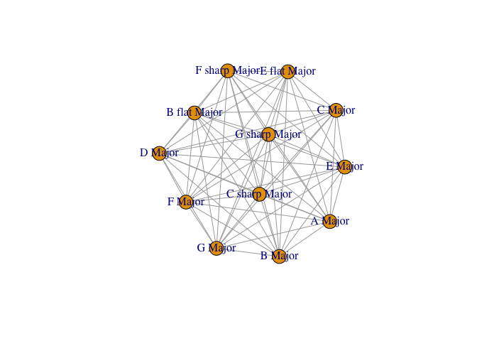
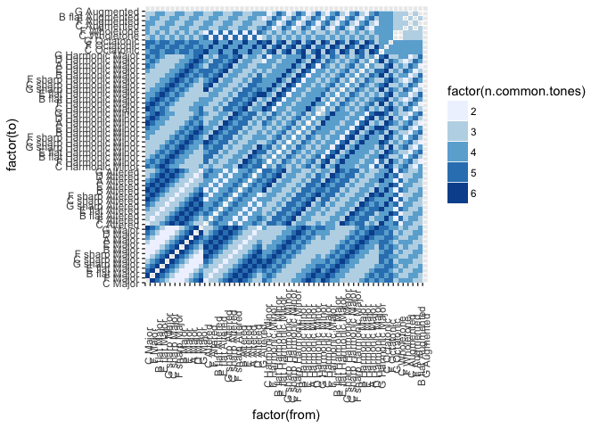

Towards a Topological Graph Theory of Jazz Scales
================
R Tyler McLaughlin
8/22/2017

Table of Contents
-----------------

1.  [Motivation](#motivation)
2.  [Planarity Testing](#planarity)
3.  [Data wrangling in R](#wrangling)
4.  [The Jazz Scale Network Adjacency Matrix](#matrix)
5.  [Python classes and functions for studying musical scales](#classes)
6.  [Method for Building Network of Jazz Scales](#method)

<a name="motivation" /> Motivation
----------------------------------

### Unexpected shapes in data

After reading about unsupervised machine learning algorithms, like those in manifold learning, I became very interested in the shapes of datasets. I wanted to explore my own data sets and see how I could represent them in 2 or 3 dimensions.
After some reading, I learned how the feature space of natural images is embedded on a **Klein bottle** \[@carlsson2008\], the famous topological curiosity that is locally 2-dimensional yet cannot be fully embedded or "placed" in 3 dimensions without self-intersecting.
I found this to be one of those few times where the results of an investigation are so completely astonishing, that it changes the way I think. Carlsson's work inspired me to look at all data more deeply.

### Jazz is complex and structured, too

Much like feature-rich natural image data, jazz harmony appears to be highly complex.
For example, improvising jazz musicians know when to play one scale instead of another because of a language-like musical vocabulary.
The harmonic context--the chords and melodies played by other instruments--dictates the musician's choice of a scale because this context limits the number of scales that could possibly sound good.

A further complexity is the choice of how to make a key change. Most jazz standards (and many pop songs, too!) have key changes. For an example, in "Blue in Green" by Miles Davis, the first chord goes from the key of F major to the key of A altered.
How did the composer of this song know to use A altered? Why not G altered? Trying it out on the piano, G altered doesn't sound as good. Why doesn't it sound as good? It probably has something to do with how our memory of the old scale meshes with the new perception of the new scale.

### Conceptualizing the scale network

I've noticed that scales can be described in terms of "distances" from other scales.

For the simplest example of this, take the C major scale which has no flats or sharps. It is reasonable to think that the C major scale is *closer* to the F major scale which has one flat than to the Ab major scale which has four flats, including the same flat in F major.

Perhaps it is easier to think in terms of common tones. C major and F major have 6 common tones. C major and Ab major have 3 common tones.

We can calculate the number of common tones between any two scales as the intersection of pitch classes. Imbued with an unambiguous definition of scale-scale distance that uses common-tones, collections of scales become **networks** of scales. This gives us a matrix of scale-scale (intra-scale) distances.

Since there are many scale types used in jazz (Major, Altered, Harmonic Minor, Octatonic, Augmented, etc... ) and twelve notes from which we can choose one as our root, we have a very high-dimensional structure to analyze.

Also, musical notes as pitch classes are inherently circular--that is, increasing the pitch by some amount is equivalent to decreasing the pitch by another amount (for example, a Major third is the same as going down a Major Sixth. See also: Major keys in the [circle of fifths](https://en.wikipedia.org/wiki/Circle_of_fifths)).
Mathematically we say they are isomorphic to the [quotient space](https://en.wikipedia.org/wiki/Quotient_space_(topology)) Z / 12Z, which is topologically a *circle*.

### Manifolds and Music

The combination of **high-dimensionality** and **circularity** suggests that an application of the topological theory of manifolds is necessary to study musical scales and harmony. In fact, in a 2006 study published in *Science*, Dr. Dmitri Tymoczko discovered the manifold structure of the voice-leading space\[@tymoczko2006\]. In this study, it was found that all chords of N pitches have an embedding on a manifold that is an N-dimensional analog to the Moebius strip. This embedding gives a representation in which one could visualize and intuitively understand certain complex chord changes, such as Chopin's E Minor Prelude that had challenged music theorists for decades.

### Project Goals

Tymoczko's work encouraged me to consider topological graph theory applied to the jazz scales that pervade jazz as a genre. His work is clearly more general than mine. **This project is about the manifold structure of the network of the most common jazz scales.**

**Discovering the simplest 2-manifold in which the jazz scale network can be embedded is the primary goal of this study.** Can it be embedded on an orientable surface like a torus or triple torus? Must it instead be embedded on a Moebius strip-like object? Or does it have to be embedded on a Klein bottle?

**A second goal of this study is to see if this abstract problem is simplified through the use of existing empirical methods in data science, such as dimensionality reduction.** For example, what happens if we use T-SNE or Isomap algorithms on a graph? How does one implement this and does it matter that we treat a scale as a categorical variable?

<a name="planarity" /> Planarity testing
----------------------------------------

Some graphs can be embedded in the plane without intersection and these are called *planar graphs*. Others cannot be embedded in a plane because intersections are inevitable (the [utility graph](https://en.wikipedia.org/wiki/Three_utilities_problem) is a famous example).
All can, however, be embedded in 3-dimensions, and all can be embedded in a manifold that is locally 2-dimensional everywhere, such as a [torus](https://en.wikipedia.org/wiki/Torus) \[@trudeau2013\]. Those that can be embedded in a torus, no surprise, are called [toroidal graphs](https://en.wikipedia.org/wiki/Toroidal_graph)

``` r
library('curl')
library('latexreadme')
```

Mathematical displays are marked off with `\[` and `\]`, as in
*e*<sup>*i**π*</sup> = −1

Before we can visualize scale networks, we have to reshape of the data.

<a name="wrangling" /> Data Wrangling
-------------------------------------

### R Libraries

``` r
library(ggplot2)
library(data.table)
```

### Importing the Edge Table Data

``` r
edge_list_raw <- data.table(read.csv('./edgetable.csv',header = FALSE))
setnames(edge_list_raw,'V1','from')
setnames(edge_list_raw,'V2','to')
setnames(edge_list_raw,'V3','distance')
edge_list_raw[,distance:=(7-distance)]
setnames(edge_list_raw,'V4','common.tones')
setnames(edge_list_raw,'V5','from.root')
setnames(edge_list_raw,'V6','from.scale.type')
setnames(edge_list_raw,'V7','to.root')
setnames(edge_list_raw,'V8','to.scale.type')
```

We see that the data is 3186 rows. This means 3186 edges in the graph, which is equal to 57 \* 57 - 57 - 2\*(2 + 1) = 3186

### Converting to igraph

Convert to standard igraph input format, which is a 'links' data.frame and a 'nodes' data.frame. We'll be subsetting the graph in many different ways before visualizing, so let's write a function to convert from our data.frame to igraph.

``` r
library(igraph)
```

    ## 
    ## Attaching package: 'igraph'

    ## The following objects are masked from 'package:stats':
    ## 
    ##     decompose, spectrum

    ## The following object is masked from 'package:base':
    ## 
    ##     union

``` r
make.igraph <- function(edge.list){
    links <- edge.list[,.(from,to,distance,common.tones)]
    nodes <- unique(edge.list[,.(from,from.scale.type)])
    # call igraph function to build igraph object
    net <- graph_from_data_frame(d = links, vertices = nodes, directed = FALSE)
    # remove multiple edges between same pair of nodes, while keeping the attribute 
    #  of the max
    net <- simplify(net, remove.multiple = T,edge.attr.comb = max) 
    return(net)
}
```

Plotting Jazz Scale Networks
============================

Let's pretend our harmonic universe consists only of major scales and their modes. This would describe most pop music, including songs that have key changes from diatonic scale to diatonic scale. Diatonic songs like "Let it Be" by the Beatles do not change keys and stay at a single node.

``` r
major.to.major.scales = edge_list_raw[from.scale.type=='Major'][to.scale.type=='Major']

major.to.major.net = make.igraph(major.to.major.scales)
major.to.major.net
```

    ## IGRAPH df4114c UN-- 12 66 -- 
    ## + attr: name (v/c), from.scale.type (v/c), distance (e/n),
    ## | common.tones (e/c)
    ## + edges from df4114c (vertex names):
    ##  [1] C Major      --F sharp Major C Major      --B Major      
    ##  [3] C Major      --B flat Major  C Major      --F Major      
    ##  [5] C Major      --E flat Major  C Major      --G Major      
    ##  [7] C Major      --D Major       C Major      --G sharp Major
    ##  [9] C Major      --C sharp Major C Major      --A Major      
    ## [11] C Major      --E Major       F sharp Major--B Major      
    ## [13] F sharp Major--B flat Major  F sharp Major--F Major      
    ## + ... omitted several edges

On first inspection, it looks like we have successfully built a network of Major scales.

Since we are considering all distances, we are essentially building the *complete graph* because all Major scales are connected to other Major scales by some nonzero number of notes.

We can use the properties of a complete graph to check that our. This Major-Major scale network has 12 nodes, and we have 66 edges, which is what we'd expect from the complete graph formula E = n*(n-1)/2 = 12*11/2 = 66. Here's a first shot at visualizing:

``` r
plot(major.to.major.net)
```



Okay, let's do three things: filter edges by weight (i.e., isolate only the closest scale-scale edges), color edges by weight, and re-color scales.

### Circle of Fifths

The circle of fifths is essentially a network diagram of key signatures that differ by only 1 note. We can isolate this network in R by playing with the network edges via the following:

``` r
circle.of.fifths <- delete.edges(major.to.major.net,E(major.to.major.net)[E(major.to.major.net)$distance!=1])

plot(circle.of.fifths)
```


Sorting the Edge List for Plotting an Adjacency matrix
======================================================

We want to group all the scales by their type. Within a scale type, we want to order the root notes in a way that makes sense. Let's choose the circle of fifths because this will put neighboring major scales in proximity. This will see what this looks like for the Altered scales, Harmonic Minor scales, etc.

``` r
# safe way to copy a data.table
els <- copy(edge_list_raw)
# set the custom order of the levels of the scale types
els$to.scale.type <- factor(els$to.scale.type,levels=c('Major','Altered','Harmonic Minor','Harmonic Major','Octatonic','Wholetone'))
# set the order of the levels by circle of fifths
els$to.root <- factor(els$to.root,levels=c('C','F','B flat','E flat','G sharp','C sharp','F sharp','B','E','A','D','G'))
# do the same for the "from" levels;
# these will be plotted on the y #axis
els$from.scale.type <- factor(els$from.scale.type,levels=c('Major','Altered','Harmonic Minor','Harmonic Major','Octatonic','Wholetone'))
els$from.root <- factor(els$from.root,levels=c('C','F','B flat','E flat','G sharp','C sharp','F sharp','B','E','A','D','G'))

# order by levels.
els <- els[order(els$to.scale.type,els$to.root)]
els <- els[order(els$to.scale.type,els$to.root)]
```

Plotting the Adjacency Matrix<a name="matrix" />
------------------------------------------------

``` r
plot <- ggplot(els) + geom_raster(aes(x=factor(from),y=factor(to),fill=factor(distance)))   
plot + scale_x_discrete(limits=(els$from)[order(els$from.scale.type,els$from.root)]) + 
  scale_y_discrete(limits=(els$to)[order(els$to.scale.type,els$to.root)]) +
  theme(axis.text.x=element_text(angle=90)) + scale_fill_brewer()
```



<a name="classes" /> Python classes and functions for studying musical scales
-----------------------------------------------------------------------------

Created a Scale class to facilitate accessing the non-network properties of a musical scale, like the list of notes, scale type, and the root. Using a class also made easy converting the name and the notes to other data structures, like tuples and dictionaries on the fly.

``` python
class Scale(object):
    """
    Represents a single scale, which is defined as a collection of pitch classes.
    root: string
    type: string
    notes: list of ints; each int should be between 0 and 11.
    >>> myScale = Scale('E flat', 'Major Pentatonic',[3,5,7,10,0])
    """

    def __init__(self, root, type, notes):
        self.root = root
        self.type = type
        self.notes = notes
        
    def getRoot(self):
        return (self.root)

    def getType(self):
        return (self.type)

    def getName(self):
        name = self.root + " " + self.type
        return name

    def getTupleName(self):
        tuple_name = (self.root, self.type)
        return tuple_name

    def asDict(self):
        output_dict = {}
        output_dict[self.getTupleName()] = self.notes
        return output_dict

    def testScale(self):
        message1 = "test scale is " + self.getName()
        message2 = " with notes " + str(self.notes)
        print message1 + message2
        
# here are some asymmetrical scales
C_MAJOR = Scale("C", "Major", [0, 2, 4, 5, 7, 9, 11])
C_ALTERED = Scale("C", "Altered", [0, 1, 3, 4, 6, 8, 10])
C_HARMONIC_MAJOR = Scale("C", "Harmonic Major", [0, 2, 4, 5, 7, 8, 11])
C_HARMONIC_MINOR = Scale("C", "Harmonic Minor", [0, 2, 3, 5, 7, 8, 11])
```

<a name="method" /> Method for Building Network of Jazz Scales
--------------------------------------------------------------

An adjacency matrix is a common way to represent edges between nodes on a graph.

A list of all edges is sufficient for building an adjacency matrix.

The python code here uses recursion to generate an adjacency matrix for jazz scales. First it starts at C Major, and looks for all scales that share N = 6 common tones with C Major. These scales are: F Major, G Major, C Harmonic Major, C\# Altered, B Altered, and A Harmonic Minor. All of these scales are printed in edgetable.csv, along with N and the set of common tones (for C Major and F Major, this set is \[0, 2, 4, 5, 7, 9\]). Then it looks for all scales that share N = 5 common tones with C Major, including D Major, B flat Major, F octatonic, and ten more scales. It continues to look for the scales relative to C Major, decrementing N until we get to scales that share only two notes with C Major, namely the scales F\# Major, C Altered, and several others.

We are done with the initial step of the recursive algorithm. Next, we actually recurse, and for each the neighboring scales found above, we find its neighbors for integers N less than or equal to 6.

The recursive implementation here was not necessary but was done because it felt very *intuitive* for me as a piano player and composer.
Given C Major, to which scales can we modulate without sounding too avant garde or "Out to Lunch"? B altered sounds great, but Bb altered sounds terrible. Instead of recursion, we could say, for each jazz scale, merely iterate over all other jazz scales and record the number of common tones. This would be implemented with a much simpler nested for loop. You could then sort afterwards. This algorithm would be slightly more efficient (you wouldn't have to check to avoid repeating pairs of scales), but efficiency wasn't really an issue for such a small data set of 57 scales.

References
==========
